# PokéBloom - Back Readme

## Descripción del proyecto

PokéBloom es una Pokédex web con un estilo pastel y amigable. Permite explorar el catálogo de Pokémon, buscar, ver la ficha completa de cada uno, filtrar la colección, guardar favoritos, armar equipos y ver su sinergia, consultar estadísticas de la comunidad, y contiene funciones propias como un modo coleccionista con insignias, un minijuego de adivinar Pokémon, la opción de compartir fichas o equipos, un diario personal de notas, y un Pokémon destacado cada día. También existe un rol de administrador encargado de mantener el catálogo y de gestionar las cuentas de la comunidad.

Este repositorio contiene el backend de la aplicación, encargado de la lógica de negocio, la persistencia de los datos y la seguridad.

## Documento de requerimientos

El análisis completo de requerimientos funcionales y no funcionales, junto con las reglas de negocio, se encuentra en el siguiente documento.

Enlace al documento de requerimientos: agregar aquí el enlace del documento una vez esté subido al repositorio o a Google Drive.

## Diagramas

### Diagramas casos de uso requerimientos funcionales

Requerimiento funcional 1
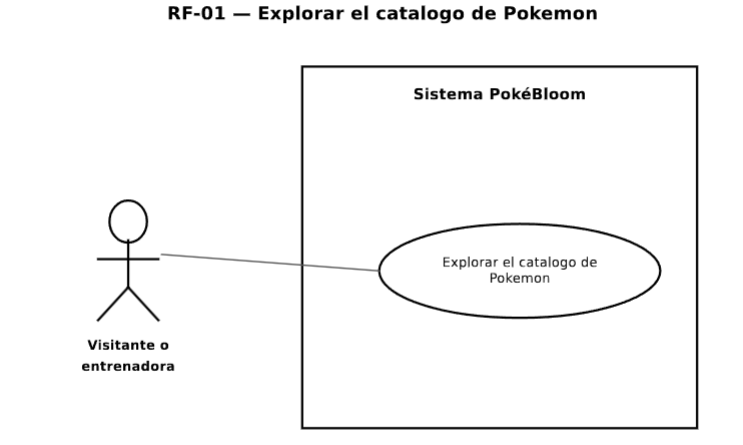
Requerimiento funcional 2
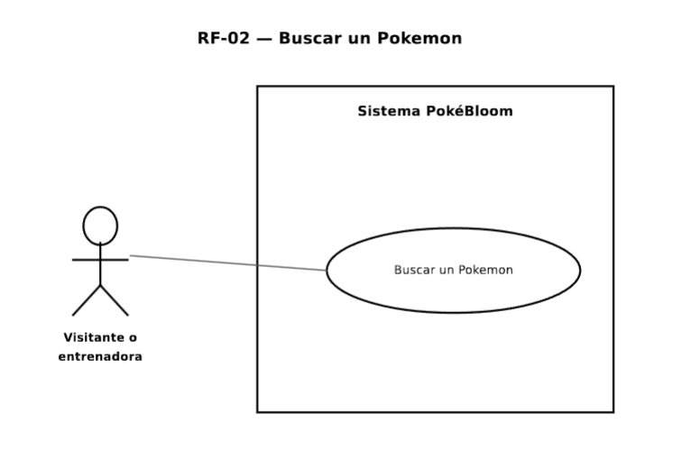
Requerimiento funcional 3
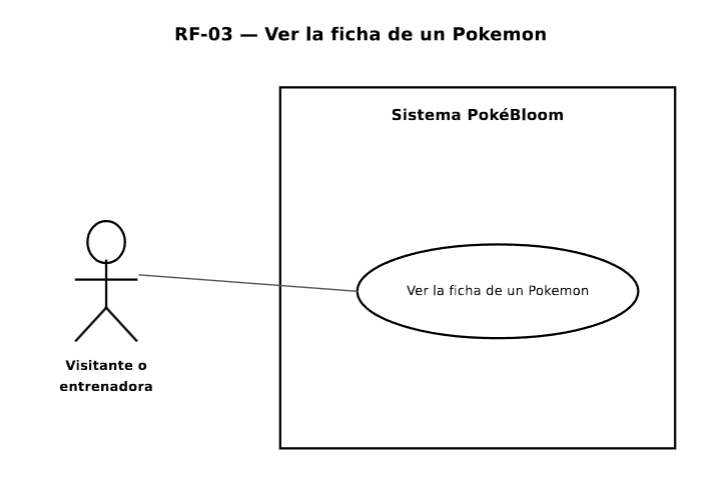
Requerimiento funcional 4
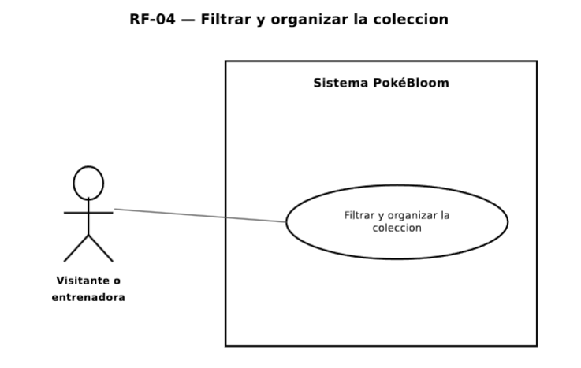
Requerimiento funcional 5
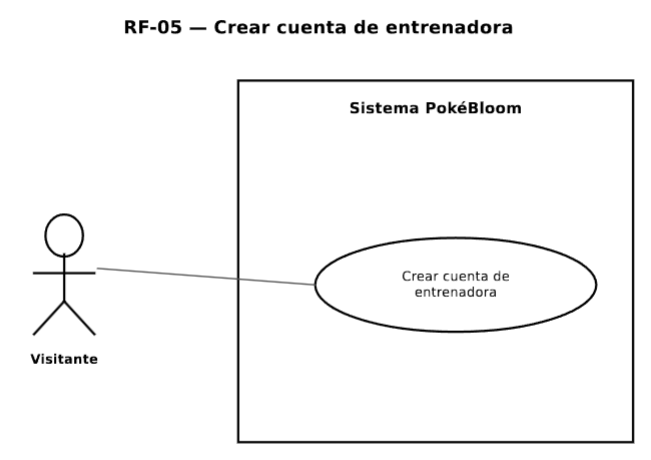
Requerimiento funcional 6
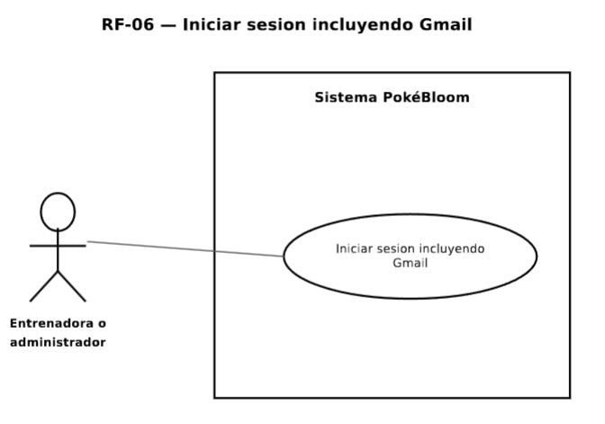
Requerimiento funcional 7
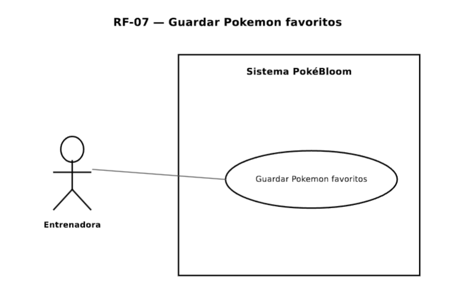
Requerimiento funcional 8
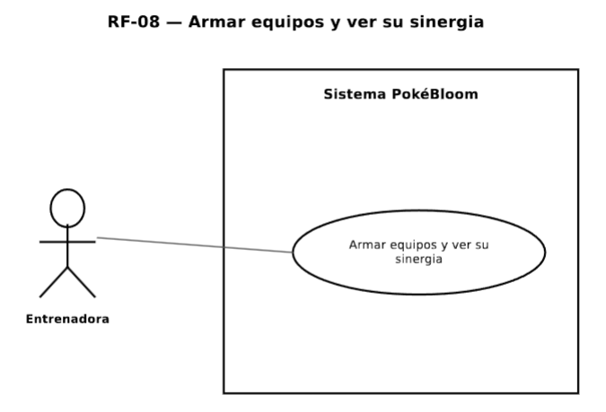
Requerimiento funcional 9
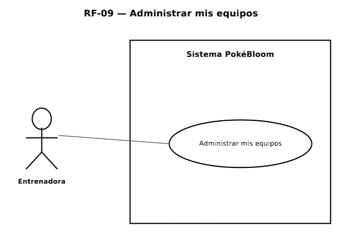
Requerimiento funcional 10
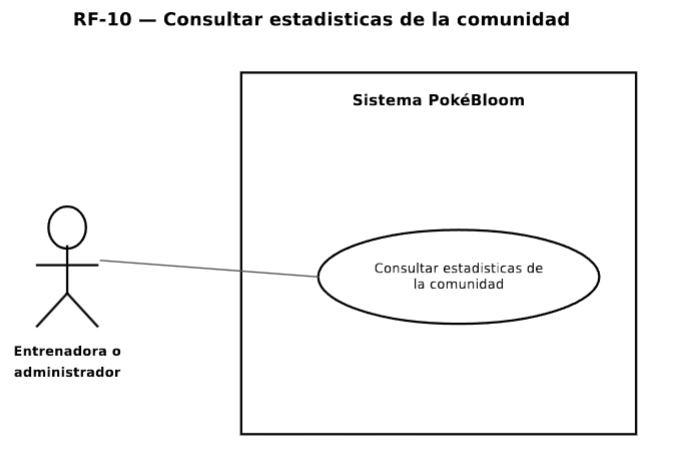
Requerimiento funcional 11
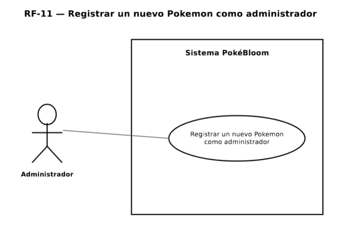
Requerimiento funcional 12
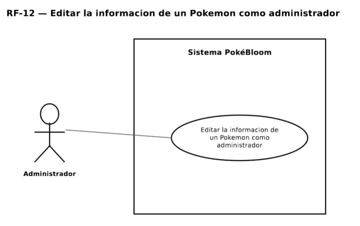
Requerimiento funcional 13
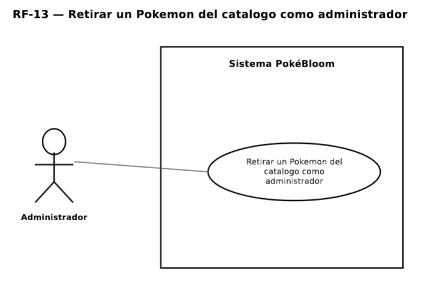
Requerimiento funcional 14
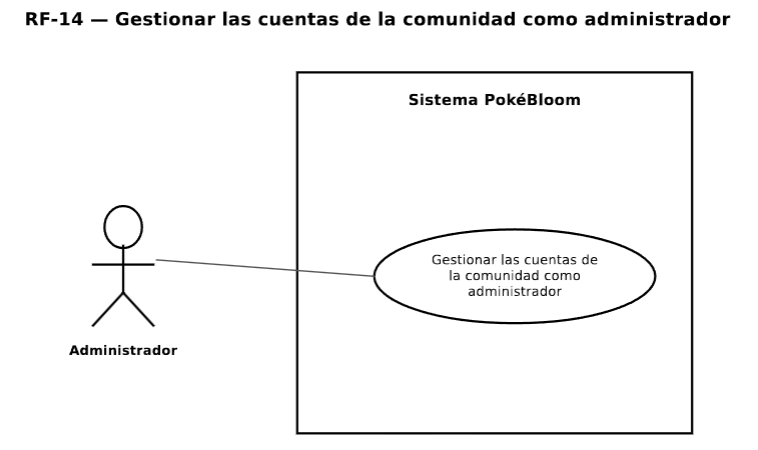
Requerimiento funcional 15
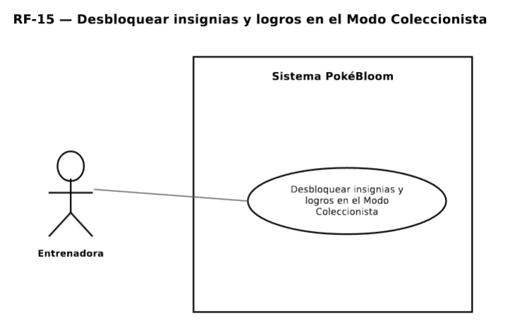
Requerimiento funcional 16
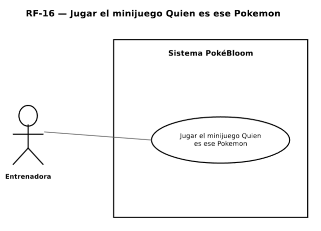
Requerimiento funcional 17
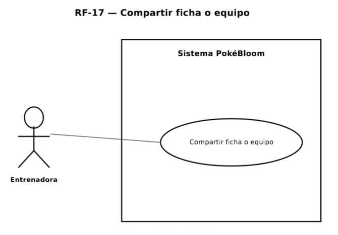
Requerimiento funcional 18
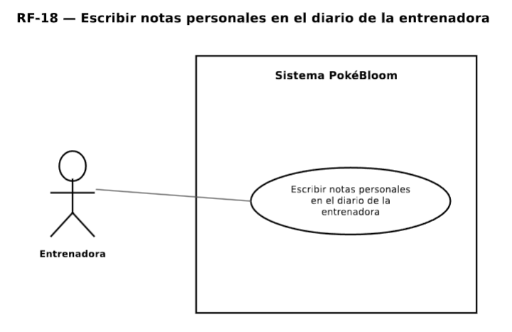
Requerimiento funcional 19
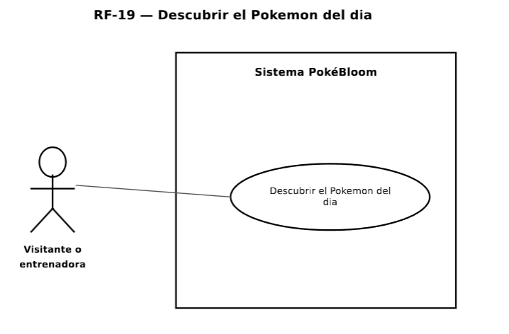

### Diagrama de clases

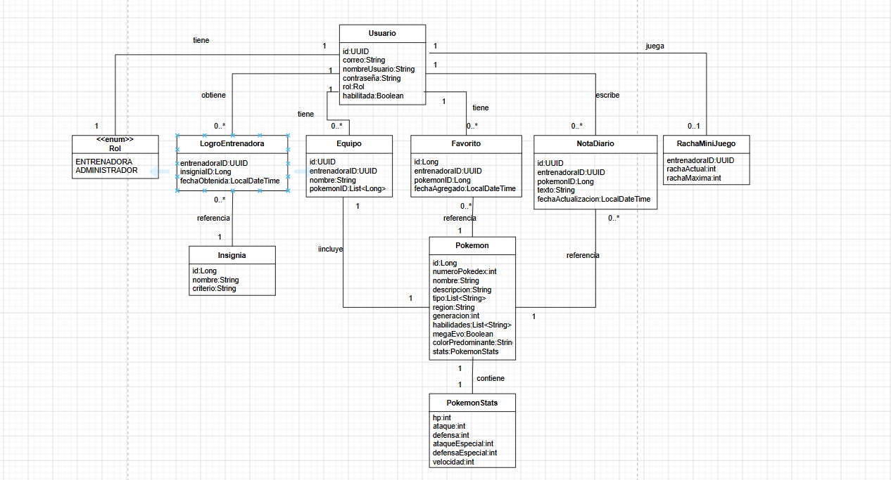

### Diagrama de contexto

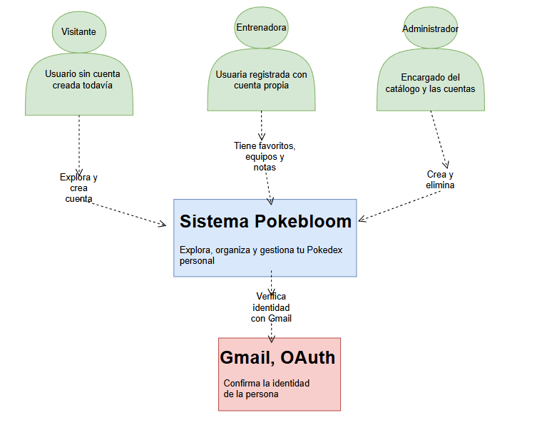