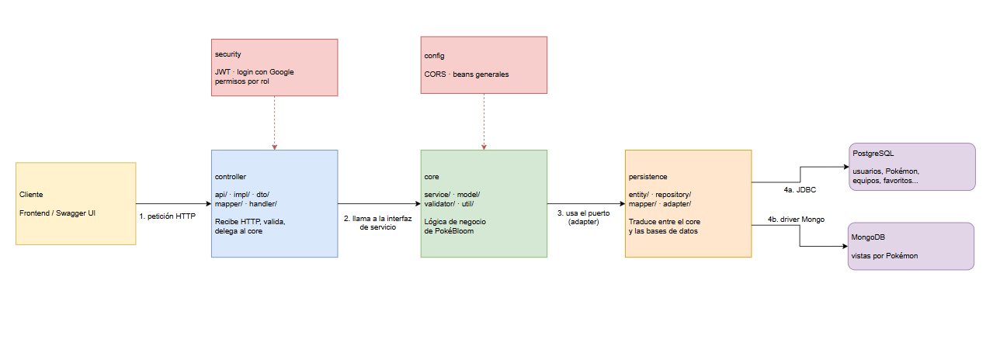

# Documento de Arquitectura — PokéBloom Backend

DOSW 2026-I · Sara Viviana Arteaga Rodríguez

## 1. ¿Qué es este documento?

Este documento explica cómo está organizado el backend de PokéBloom por dentro: qué carpetas hay, qué hace cada una, y por qué se decidió organizarlo así. El README explica cómo usar el proyecto; este documento explica cómo está construido.

## 2. Arquitectura por capas

El proyecto está dividido en 5 carpetas principales dentro de `src/main/java/com/pokedex/pokedex_api/`, y cada una tiene un trabajo específico:

```
controller/   → recibe las peticiones HTTP y responde en JSON
core/         → la lógica de negocio (las reglas de PokéBloom)
persistence/  → guarda y consulta datos en PostgreSQL y MongoDB
security/     → login, JWT, permisos por rol
config/       → configuración general (CORS, etc.)
```

**La regla principal:** `controller` solo habla con `core`, y `core` solo habla con `persistence` a través de interfaces (no directamente con las clases de la base de datos). Esto quiere decir que si algún día se quiere cambiar de PostgreSQL a otra base de datos, o cambiar cómo se reciben las peticiones, la lógica de negocio en `core` no se tendría que tocar.

**¿Por qué se organizó así y no como estaba antes?** El proyecto originalmente tenía todas las clases en un solo paquete, mezclando controladores, entidades y lógica de negocio en el mismo lugar. Con esta separación es más fácil encontrar las cosas, y más fácil probar la lógica de negocio sin necesitar una base de datos real corriendo (por eso las pruebas unitarias de `core` no usan Docker).

Diagrama de referencia: 

## 3. Qué hace cada capa

### controller
Recibe las peticiones (`GET /v1/pokemon`, `POST /v1/teams`, etc.), valida que los datos que llegan tengan el formato correcto, y llama a `core` para que haga el trabajo real. También se encarga de convertir los errores en respuestas JSON entendibles (`GlobalExceptionHandler`).

### core
Aquí está toda la lógica de negocio: crear un equipo, calcular la sinergia de tipos, desbloquear una insignia, validar que un correo no esté repetido, etc. Los modelos de esta capa (`Pokemon`, `User`, `Team`) son clases simples de Java, sin nada relacionado a bases de datos — por eso se llaman "modelos de negocio" y no "entidades".

### persistence
Aquí sí están las clases que hablan con la base de datos: las entidades JPA (anotadas con `@Entity`) para PostgreSQL, y los documentos para MongoDB. También están los "adapters", que son las clases que traducen entre el modelo de negocio de `core` y las entidades de la base de datos.

### security
Todo lo de login: generar y validar el token JWT, revisar qué rol tiene cada usuario, permitir el login con Google.

### config
Configuración que no es lógica de negocio ni de seguridad: por ejemplo, permitir que el frontend (que corre en otra dirección) pueda hacerle peticiones a esta API (CORS).

## 4. Dos bases de datos, ¿por qué?

- **PostgreSQL**: para casi todo — usuarios, Pokémon, equipos, favoritos, insignias, diario. Son datos que necesitan mantenerse relacionados entre sí (un favorito tiene que apuntar a un usuario y un Pokémon que sí existan).
- **MongoDB**: solo para contar las vistas de cada Pokémon (cuántas veces se ha consultado su ficha). Es un dato simple que se actualiza muy seguido, y no necesita relacionarse con nada más, así que no hacía falta meterlo en una tabla de PostgreSQL.

## 5. Algunas decisiones que se tomaron

- **Los DTO (lo que entra y sale por la API) son `record` de Java.** Un `record` es una forma corta de escribir una clase que solo guarda datos, sin necesitar escribir manualmente los getters. Como además es inmutable (no se puede modificar después de creado), evita bugs donde alguien cambia un dato sin querer.
- **Se usa MapStruct para convertir entre DTO y modelos de negocio en los casos más complicados** (por ejemplo, `Pokemon`, que tiene varias listas y un objeto de estadísticas adentro). MapStruct genera ese código de conversión automáticamente al compilar. Para las conversiones más simples (como Favoritos, que solo tiene 3 campos) se escribió el código de conversión a mano, porque no valía la pena configurar MapStruct para algo tan pequeño.
- **Las insignias se revisan en segundo plano.** Cuando alguien marca un favorito, no tiene que esperar a que el sistema revise las 9 insignias posibles antes de recibir la respuesta — esa revisión pasa después, sin bloquear al usuario.
- **El número de Pokédex no se puede editar** una vez creado el Pokémon (regla de negocio RN-06), y **no se puede retirar un Pokémon del catálogo si está en uso** en algún equipo o favorito (RN-07) — esas reglas están validadas en `core`, no solo en la base de datos.

## 6. Seguridad

- El login puede ser con correo/contraseña o con una cuenta de Google.
- Ambos casos terminan generando el mismo tipo de token (JWT), así que el resto de la aplicación no necesita saber cómo entró la persona.
- Las contraseñas nunca se guardan en texto plano — se guardan encriptadas con BCrypt.
- Hay 3 roles: sin cuenta (solo puede ver el catálogo), entrenadora (TRAINER) y administrador (ADMIN). Cada endpoint revisa el rol antes de dejar pasar la petición.
- Los favoritos y las notas del diario son privados: cada quien solo puede ver los suyos, sin importar si conoce el id de los de alguien más.

## 7. Pruebas

Además de las pruebas automáticas (`mvn test`, con cobertura de código de aproximadamente 78%), se hicieron pruebas manuales sobre la aplicación corriendo de verdad (con Docker), probando cada funcionalidad por Swagger. Esas pruebas manuales están documentadas en `docs/PruebasFuncionales.md`.

## 8. Documentos relacionados
- Requerimientos: [Correccion_analisis _de _requerimientos_Pokebloom.pdf](Correccion_analisis%20_de%20_requerimientos_Pokebloom.pdf)
- Cómo usar el proyecto y lista de endpoints: `README.md`
- Pruebas manuales: [PruebasFuncionales.md](PruebasFuncionales.md)
